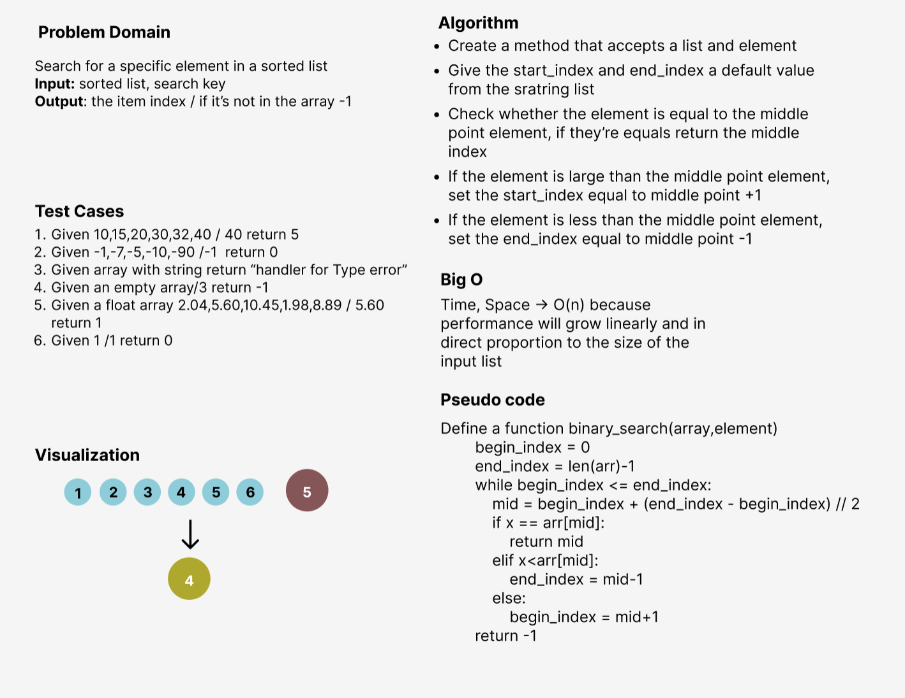

# Array Binary Search
<!-- Description of the challenge -->
I've took two arguments in the function: list and element, then returned the index of the element if its exist in the list,
-1 if it's not exist in the list

## Whiteboard Process
<!-- Embedded whiteboard image -->

## Approach & Efficiency
I've used the functions approach to make the code more efficient and reusable since creating a function 
will be computationally cheaper and will create a much cleaner (readable) code as well.
