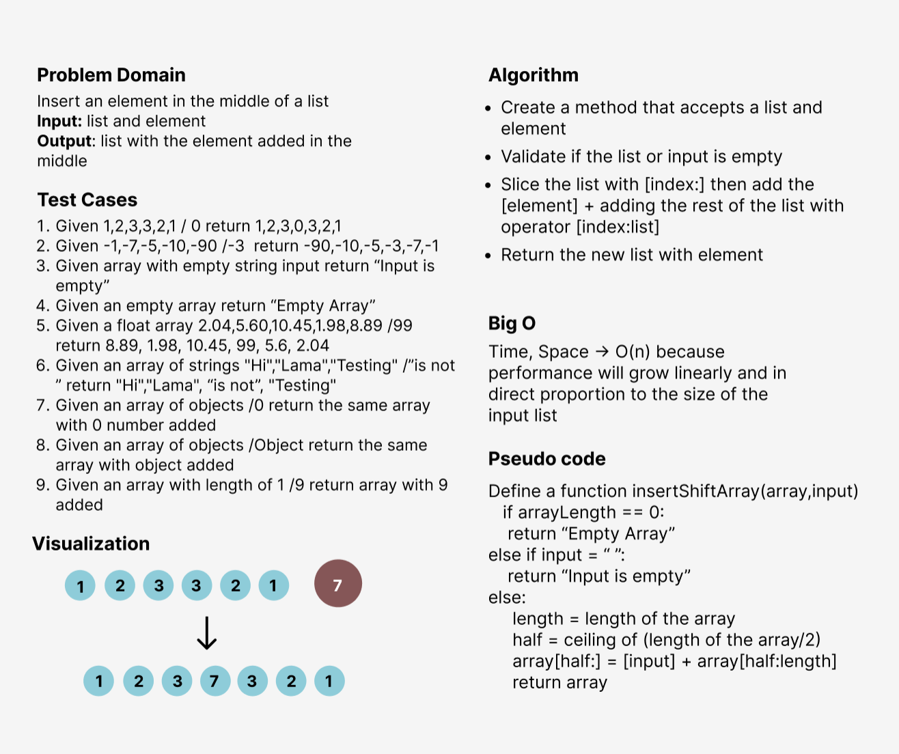

# Insert Shift Array
<!-- Description of the challenge -->
I've take two arguments in the function: list and input, then added the input variable in the middle on the list.
with some validations on the empty list and empty string input

## Whiteboard Process
<!-- Embedded whiteboard image -->

## Approach & Efficiency
I've used the functions approach to make the code more efficient and reusable since creating a function 
will be computationally cheaper and will create a much cleaner (readable) code as well.