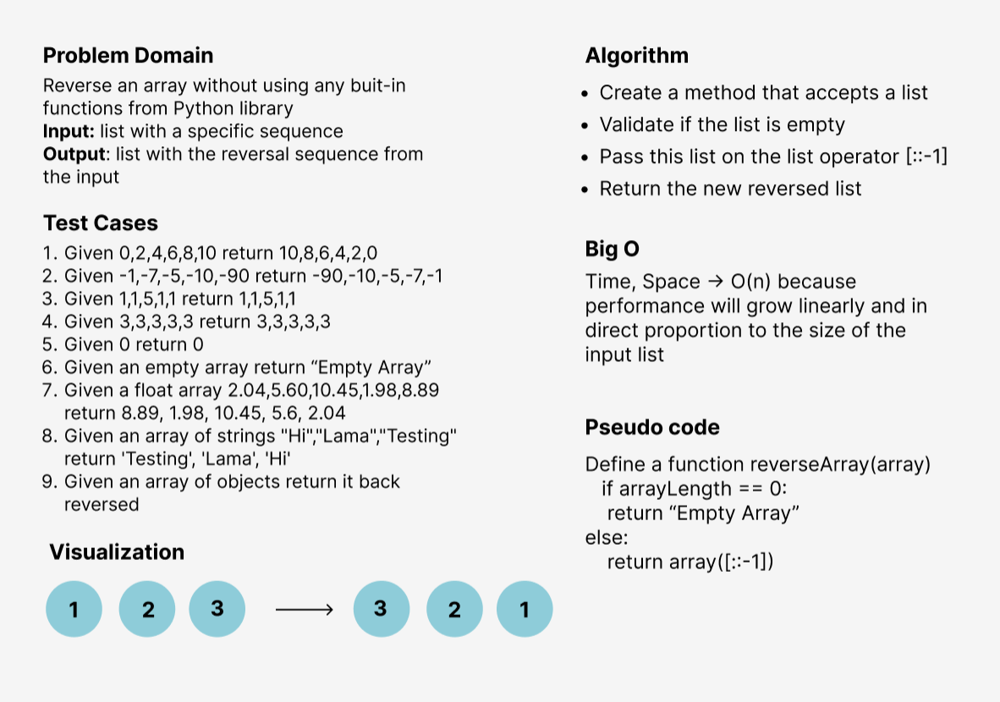

# Reverse an Array
<!-- Description of the challenge -->
I've reordered the array elements to be as the first element the last and the last is the first.
No matter of the values I've just inverted the arrangement of the list

## Whiteboard Process
<!-- Embedded whiteboard image -->

## Approach & Efficiency
I've used the functions approach to make the code more efficient and reusable since creating a function 
will be computationally cheaper and will create a much cleaner (readable) code as well.