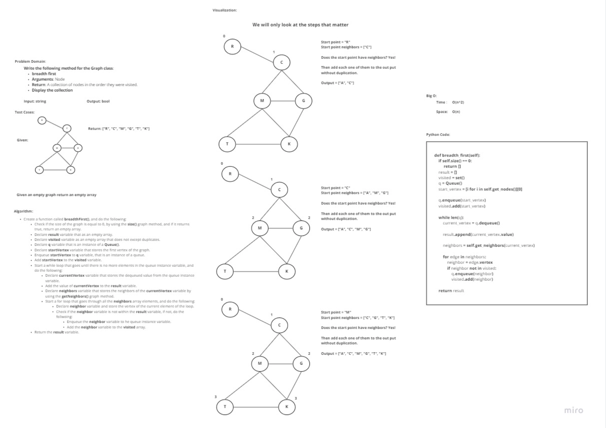

# Challenge Summary
Write the following method for the Graph class:

- breadth first

    - Arguments: Node

    - Return: A collection of nodes in the order they were visited.

    - Display the collection
## Whiteboard Process

## Approach & Efficiency
 Iterative approach, as for the Big O:

- Time: O(n^2)
- Space: O(n)

## Solution
In order to run the code enter "python graph_breadth_first\graph_breadth_first.py"

In order to run the tests enter "pytest graph_breadth_first\tests\test_graph_breadth_first.py"