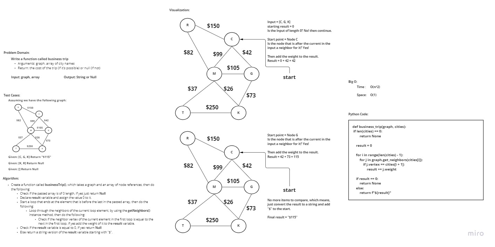

# Challenge Summary
<!-- Description of the challenge -->
Write a function called business trip
- Arguments: graph, array of city names
- Return: the cost of the trip (if it’s possible) or null (if not)

## Whiteboard Process
<!-- Embedded whiteboard image -->

## Approach & Efficiency
<!-- What approach did you take? Why? What is the Big O space/time for this approach? -->
I took an iterative approach, as for Big O:

Time: O(n^2)
Space: O(1)

## Solution
<!-- Show how to run your code, and examples of it in action -->
To run the code enter "python graph_business_trip.py"

To run the tests enter "pytest test_graph_business_trip.py"