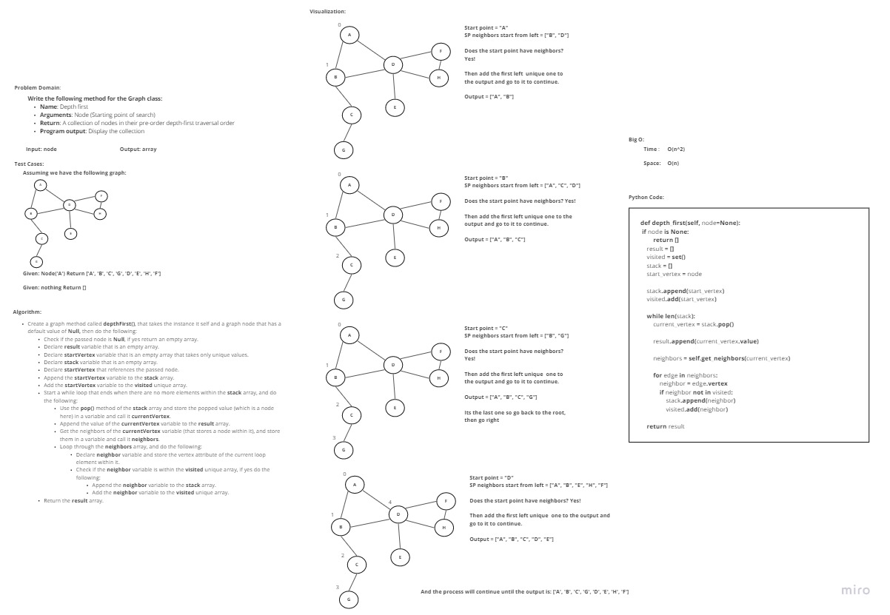

## Depth First Traversal
Depth first is a graph traversal technique that uses one of the following:

pre-order

in-order

post-order
## Challenge
Write the following method for the Graph class:

- Name: Depth first
- Arguments: Node (Starting point of search)
- Return: A collection of nodes in their pre-order depth-first traversal order
- Program output: Display the collection

## Approach & Efficiency
I took an iterative approach, the traversal technique used is pre-order, as for the Big O:

Time: O(n^2)
Space: O(n)
## Solution

## How to run:
- To run the code : "python graph_depth_first.py"

- To order to run the tests : "pytest test_graph_depth_first.py"