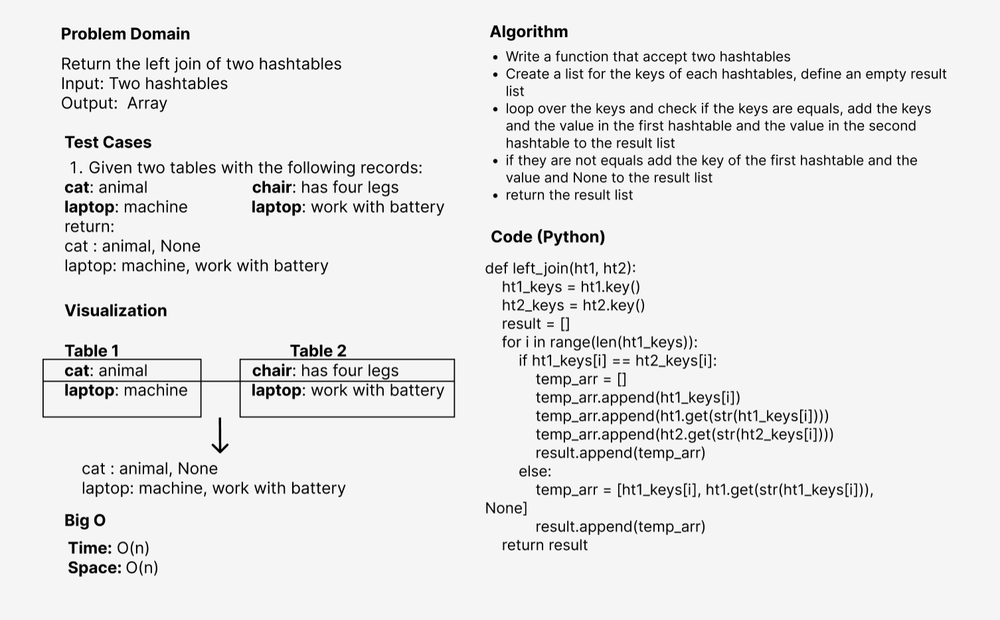

# Hashmap LEFT JOIN
<!-- Short summary or background information -->
- Combine the key and corresponding values (if they exist) into a new data structure according to LEFT JOIN logic.
- LEFT JOIN means all the values in the first hashmap are returned, and if values exist in the “right” hashmap, they are appended to the result row.

## Challenge
<!-- Description of the challenge -->
- a function called left join
- Arguments: two hash maps
1. The first parameter is a hashmap that has word strings as keys, and a synonym of the key as values.
2. The second parameter is a hashmap that has word strings as keys, and antonyms of the key as values.

## Approach & Efficiency
<!-- What approach did you take? Why? What is the Big O space/time for this approach? -->
I used the function approach to make the code more efficient and reusable since creating a methods for executing the program and testing
will be computationally cheaper and will create a much cleaner (readable) code as well.

**The Big O notation is:**
- Time --> O(N) 
- Space --> O(N)

## Solution
<!-- Embedded whiteboard image -->
