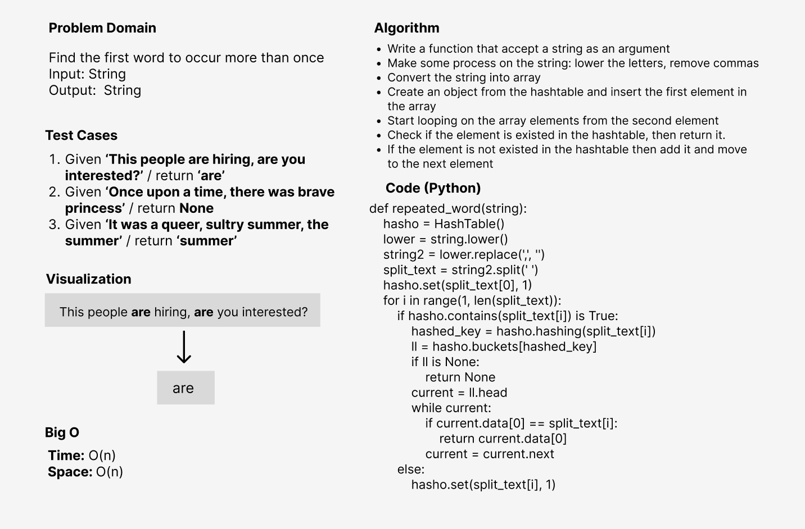

# Challenge Summary
<!-- Description of the challenge -->
It's a function called repeated_word() that finds the first word to occur more than once in a string

## Whiteboard Process
<!-- Embedded whiteboard image -->

## Approach & Efficiency
<!-- What approach did you take? Why? What is the Big O space/time for this approach? -->
I used the function approach to make the code more efficient and reusable since creating a methods for executing the program and testing
will be computationally cheaper and will create a much cleaner (readable) code as well.

**The Big O notation is:**
- Time --> O(N) 
- Space --> O(N)

## Solution
<!-- Show how to run your code, and examples of it in action -->
1. Get an article with a repeated words in it
2. Pass it to the function
3. The function will return the first word repeated