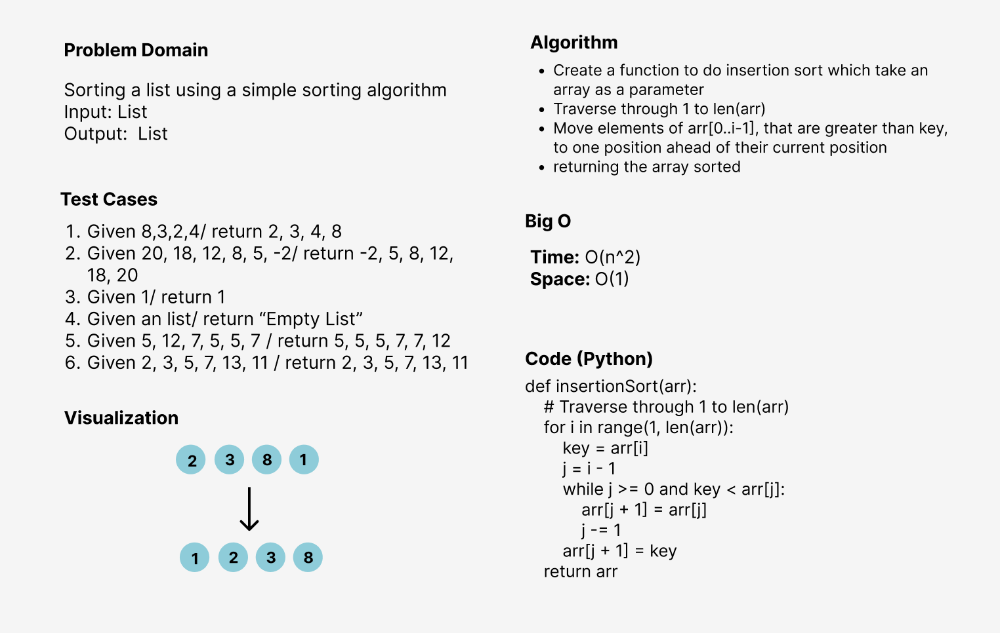

# Challenge Summary
Insertion sort is a sorting algorithm that places an unsorted element at its suitable place in each iteration.
Insertion sort works similarly as we sort cards in our hand in a card game.
We assume that the first card is already sorted then, we select an unsorted card.

## Whiteboard Process

## Approach & Efficiency
I used the function approach to make the code more efficient and reusable since creating a methods for executing the program and testing
will be computationally cheaper and will create a much cleaner (readable) code as well.

**The Big O notation is:**
- Time --> O(N^2) 
- Space --> O(1)

## Solution
- Create a simple list
- Pass it to the insertion sort function
- It will return the list sorted