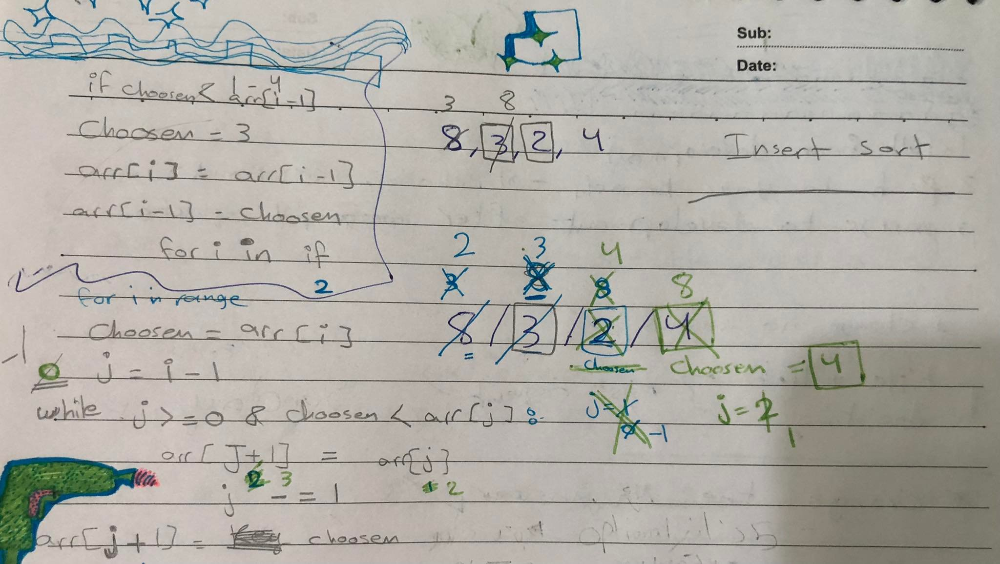

## Insertion Sort

Sorting a list using a simple sorting algorithm

Input: List

Output:  List
## Pseudo Code

    SelectionSort(int[] arr)
        DECLARE n <-- arr.Length;
    FOR i = 0; i to n - 1  
        DECLARE min <-- i;
        FOR j = i + 1 to n
            if (arr[j] < arr[min])
                min <-- j;

        DECLARE temp <-- arr[min];
        arr[min] <-- arr[i];
        arr[i] <-- temp;

## Efficency
- Time: O(n^2)
- Space: O(1)