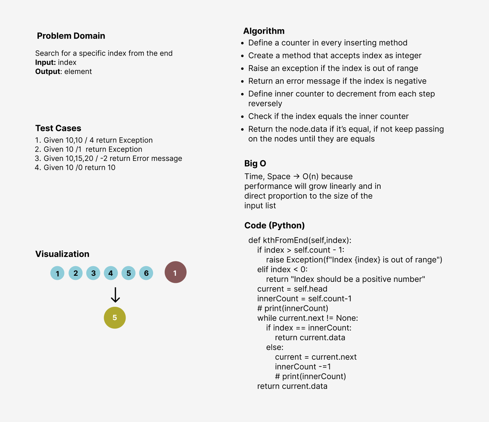

# Singly Linked List
Singly linked list can be defined as the collection of ordered set of elements. The number of elements may vary according to need of the program.

## Challenge
Creating a linked list and the insertion is on the head of the list by using two classes, one for the **Node** and one for the **LinkedList**,
with six methods in the LinkedList class.

## Approach & Efficiency
<!-- What approach did you take? Why? What is the Big O space/time for this approach? -->
I've used the methods approach to make the code more efficient and reusable since creating a methods for executing the program and testing
will be computationally cheaper and will create a much cleaner (readable) code as well.
The Big O notation is **O(1)** time performance

## API
1. Insert --> add to beginning
2. ToString --> to print the created list in a specific format
3. Includes --> to check a specific element if it exists in the list or not
4. Append --> add to the last
5. InsertBefore --> to add any element before a specific element
6. InsertAfter --> to add any element after a specific element
7. kthFromEnd --> to search for elements by index from the end of the list

## White Board
- Linked List Kth
