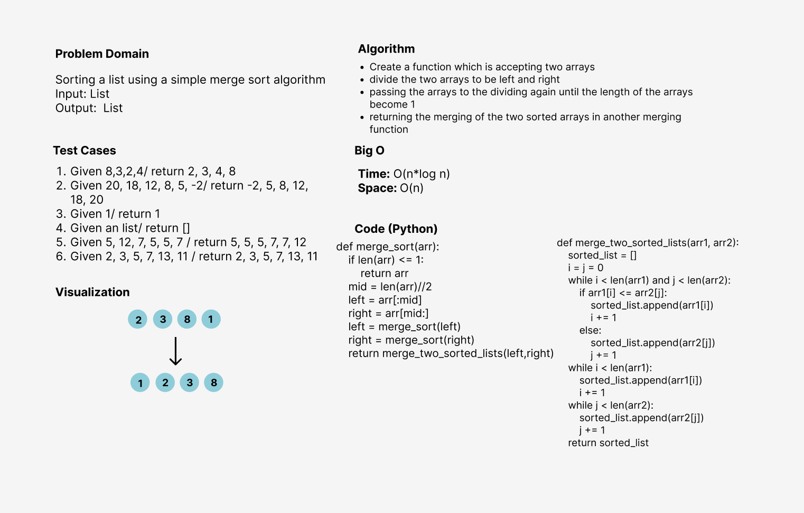

# Challenge Summary
Merge Sort is a Divide and Conquer algorithm. It divides input array in two halves,
calls itself for the two halves and then merges the two sorted halves.
The merge_two_sorted_lists() function is used for merging two halves.

## Whiteboard Process

## Approach & Efficiency
I used the function approach to make the code more efficient and reusable since creating a methods for executing the program and testing
will be computationally cheaper and will create a much cleaner (readable) code as well.

**The Big O notation is:**
- Time --> O(n*log n)
- Space --> O(n)

## Solution
- Create an unsorted simple list
- Pass it to the merge_sort function
- It will return the list sorted