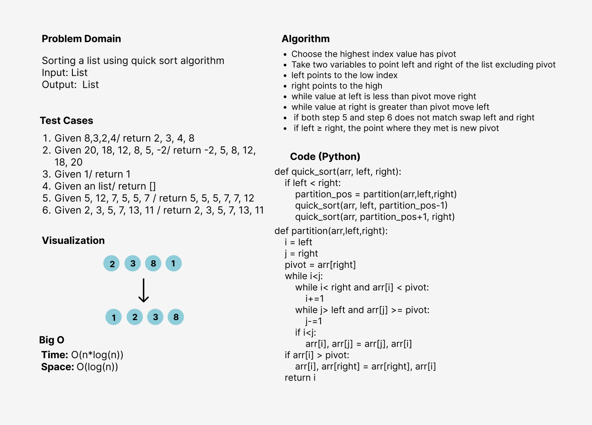

# Challenge Summary
QuickSort is a divide and conquer algorithm. It picks an element as a pivot and partitions
the given array around the picked pivot.
There are many different versions of quickSort that pick pivot in different ways. 

## Whiteboard Process

## Approach & Efficiency
I used the function approach to make the code more efficient and reusable since creating a methods for executing the program and testing
will be computationally cheaper and will create a much cleaner (readable) code as well.

**The Big O notation is:**
- Time: O(n*log(n))
- Space: O(log(n))

## Solution
- Create a simple list
- Pass it to the quick sort function
- print the list it will be sorted