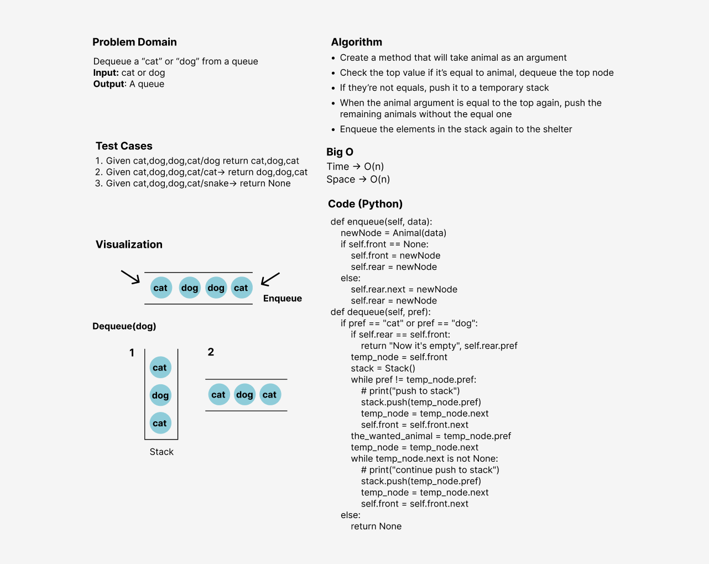

# Challenge Summary
<!-- Description of the challenge -->
I've created a queue as animal shelter, and I need to dequeue either cat or dog from it based on the required animal to be removed from the queue.

## Whiteboard Process
<!-- Embedded whiteboard image -->

## Approach & Efficiency
<!-- What approach did you take? Why? What is the Big O space/time for this approach? -->
<!-- What approach did you take? Why? What is the Big O space/time for this approach? -->
I've used the methods approach to make the code more efficient and reusable since creating a methods for executing the program and testing
will be computationally cheaper and will create a much cleaner (readable) code as well.
The Big O notation is **O(n)** time and space performance

## Solution
<!-- Show how to run your code, and examples of it in action -->
1. Create a new shelter instance from the class AnimalShelter
2. Enqueue in the shelter either cat or dog
3. Dequeue from the shelter a cat or a dog, and I will remove the first cat or dog will be the front of the queue I find