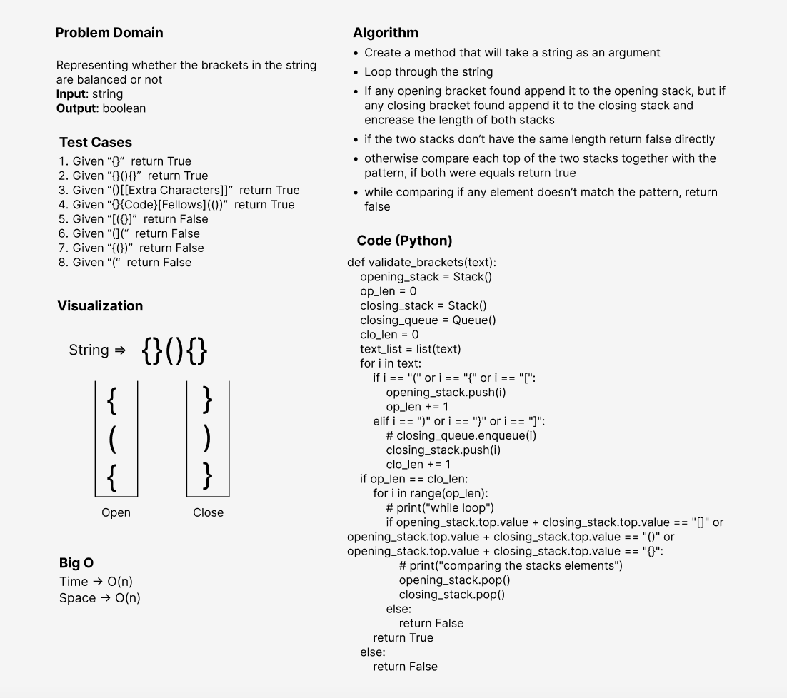

# Challenge Summary
<!-- Description of the challenge -->
I wrote a function called validate brackets
Arguments: string
Return: boolean
representing whether the brackets in the string are balanced or not

## Whiteboard Process
<!-- Embedded whiteboard image -->

## Approach & Efficiency
<!-- What approach did you take? Why? What is the Big O space/time for this approach? -->
I've used the methods approach to make the code more efficient and reusable since creating a methods for executing the program and testing
will be computationally cheaper and will create a much cleaner (readable) code as well.
The Big O notation is **O(n)** time and space performance

## Solution
<!-- Show how to run your code, and examples of it in action -->
- Call the function validate_brackets with any string containing any type of brackets
- It will return True if the brackets are balanced, false if they're not