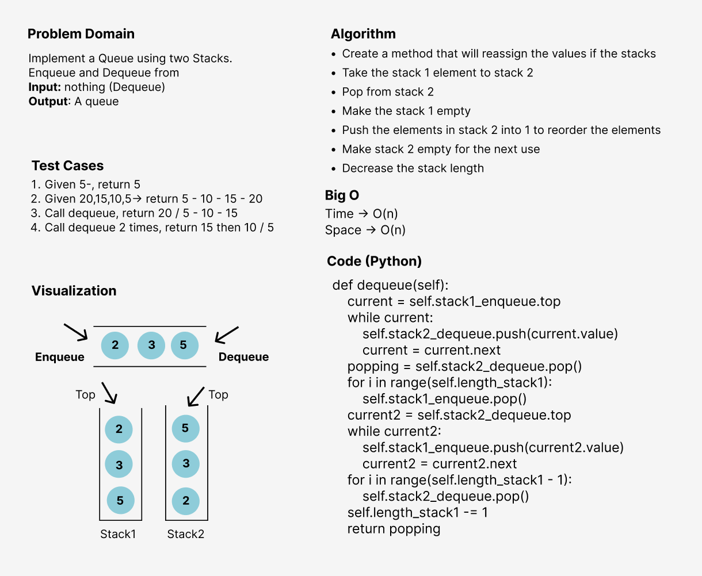

# Challenge Summary
<!-- Description of the challenge -->
I've implemented a Queue using two Stacks, with some restriction that The Stack instances have only push, pop, and peek methods. 
While I'm using my own Stack implementation. Instantiate these Stack objects in my PseudoQueue constructor.

## Whiteboard Process
<!-- Embedded whiteboard image -->

## Approach & Efficiency
<!-- What approach did you take? Why? What is the Big O space/time for this approach? -->
I've used the methods approach to make the code more efficient and reusable since creating a methods for executing the program and testing
will be computationally cheaper and will create a much cleaner (readable) code as well.
The Big O notation is **O(n)** time and space performance

## Solution
<!-- Show how to run your code, and examples of it in action -->
1. Create a new pseudo queue instance from the class
2. Enqueue in that pseudo queue but internally in the code it will be treated as a stack and the element will be pushed inside it
3. Dequeue from that pseudo queue, but I'll treat another stack as a container to reorder the element and give you what you need in your method calling