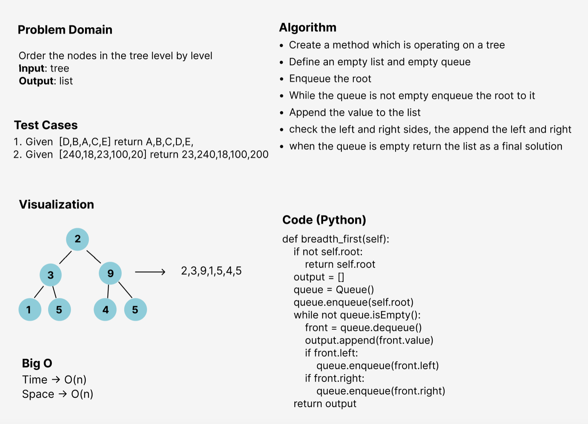

# Challenge Summary
<!-- Description of the challenge -->
I wrote a function called breadth first
Arguments: tree
Return: list of all values in the tree, in the order they were encountered

## Whiteboard Process
<!-- Embedded whiteboard image -->

## Approach & Efficiency
<!-- What approach did you take? Why? What is the Big O space/time for this approach? -->
I used the queue approach to let the nodes ordered in the required way.
O(n) --> for Space
O(n) --> for Time

## Solution
<!-- Show how to run your code, and examples of it in action -->
- Create a tree with a specific order
- Call the method breadth_first, and it will order the nodes level by level
