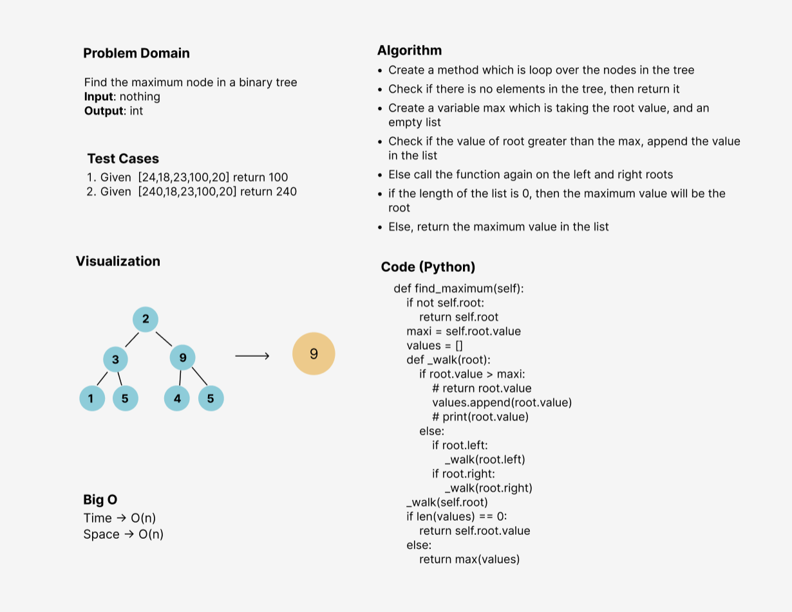

# Challenge Summary
<!-- Description of the challenge -->
I've Wrote the following method for the Binary Tree class
- find maximum value
- Arguments: none
- Returns: number

## Whiteboard Process
<!-- Embedded whiteboard image -->

## Approach & Efficiency
<!-- What approach did you take? Why? What is the Big O space/time for this approach? -->
I used the recursion in building all the methods, the Big O is:
- Time: O(n)
- Space: O(n)

## Solution
<!-- Show how to run your code, and examples of it in action -->
- Call the function find max with any binary tree
- It will return the maximum value in the tree, if it's an empty tree it will return None