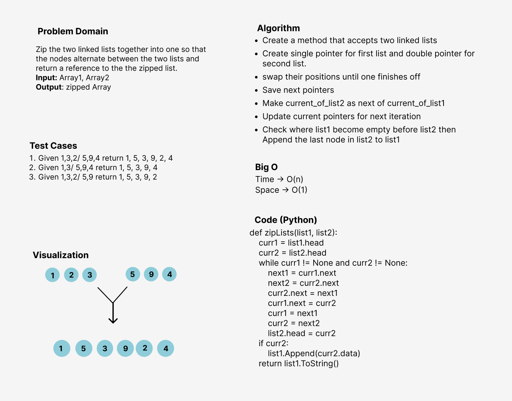

# Challenge Summary
Zip the two linked lists together into one so that the nodes alternate between the two lists and return a reference to the the zipped list.

## Whiteboard Process

## Approach & Efficiency
- Time-> **O(n)** The performance will grow linearly and in direct proportion to the size of the input list
- Space -> **O(1)** The space is not going to extend since I'm merging the lists into one of them without creating a new list

## Solution
<!-- Show how to run your code, and examples of it in action -->
- Run the zip_lists method in the zip_lists directory with creating two lists and manipulating the nodes in each one
- Run the test_zip_lists file to test the results of zip_lists method and make sure your values is returning correct
